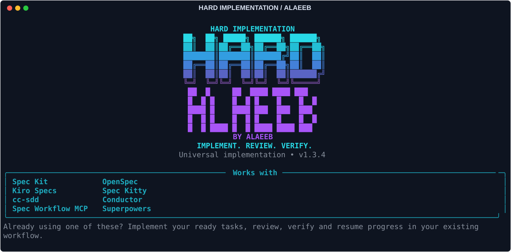

# Hard Implementation — مهارة تنفيذ Universal



دي مهارة التنفيذ الكاملة: تكتشف نظام المواصفات اللي مشروعك شغّال بيه، تقرأ المطلوب
والتصميم والمهام، تنفّذ حسب الاعتماديات، تختبر وتراجع، وتكمّل الشغل المتاح مع حفظ التقدم.

**مش خاصة بـSpec Kit بس.** بتتكامل مع الأنظمة دي:

- Spec Kit.
- Kiro Specs.
- cc-sdd.
- Spec Workflow MCP.
- OpenSpec.
- Spec Kitty.
- Conductor.
- Superpowers.

كل نظام بيفضل بنفس ملفاته وأسماء مهامه وحالاته وطريقة اعتماد الشغل عنده.
لو المهام جوه الـPlan زي Conductor، المهارة تستخدمه؛ مش تعمل `tasks.md` جديد.
ولو الشغل Work Packages زي Spec Kitty، تحافظ على الحزم وحالات المراجعة بتاعتها.

**النص الأصلي كامل: ٢٣٩٧ سطر، بكل أقسامه الـ٤٦، من غير حذف أو اختصار.**
النص المحفوظ لسه فيه اسمه التاريخي وكلمة Spec Kit؛ ضفنا تعليمات تربط الأسماء دي
بملفات النظام الحقيقي. فلسفة التنفيذ والمراجعة والتحقق والاستئناف زي ما هي.
[إثبات الحفاظ على النص](docs/PRESERVATION.md) · [شرح ربط الأنظمة](skills/hard-implementation/references/systems.md)

## أدوات البرمجة المتاحة

Codex، OpenCode، Claude Code، Hermes، Command Code، ZCode، Antigravity، Warp، Pi،
وGitHub Copilot جوه VS Code.

VS Code محرّر بيشغّل إضافات مختلفة؛ الدعم المسمّى VS Code هنا لـCopilot Agent.
لو بتستخدم إضافة Codex أو Claude جواه، اختار تكامل الأداة نفسها.
[أماكن التثبيت والتفاصيل](docs/COMPATIBILITY.md).

## التنزيل أو التحديث

لو أول مرة، ومعاك [uv](https://docs.astral.sh/uv/getting-started/installation/) وGit:

```bash
uv tool install git+https://github.com/Mohammed-AliDev/hard-implementation.git@v1.3.2
```

لو برنامج `hard` متثبت عندك من قبل:

```bash
uv tool install --reinstall git+https://github.com/Mohammed-AliDev/hard-implementation.git@v1.3.2
```

ده بينزّل برنامج `hard` مرة واحدة، والمهارة كاملة موجودة جواه. مصدر الحزمة GitHub.
لو الأمر مش ظاهر، اكتب `uv tool update-shell` وافتح التيرمنال من جديد.

## اختار الأدوات ومكان الاستخدام

من جوه مشروعك الحقيقي:

```bash
hard init
```

تختار بالأسهم أداة واحدة، أو **Choose several agents** علشان تختار مجموعة
بالـSpace، أو **All supported agents** علشان تختار الكل. وبعدها تختار المشروع ده
بس، أو كل مشاريعك على الجهاز. هتشوف المكان والاختيارات، وتأكد التثبيت.

البداية بقت بأسد بيزأر مبني على صورة أكثر واقعية، مع **HARD** وتوقيع **ALAEEB**
البنفسجي. الفرو والعينين والفك فيهم تفاصيل أكتر؛ العرض الكبير بيحتفظ بتفاصيل
أوضح، وفيه أحجام أصغر للشاشات الضيقة ونسخة بسيطة عند غياب الألوان والرموز.
[الصورة الأصلية وطريقة التوليد والعرض](docs/BRANDING.md). طريقة التنفيذ والمهارة كاملة زي ما هي.

للتثبيت المباشر للأدوات كلها من غير أسئلة:

```bash
hard init --here --agent all --yes
```

ولمجموعة أدوات في كل المشاريع:

```bash
hard init --global --agent claude --agent hermes --agent commandcode --yes
```

`--agent both` لسه معناها Codex وOpenCode زي النسخة القديمة. تقدر تكرر `--agent`
مع أسماء الأدوات اللي عايزها. البرنامج بيضيف دعمها ويحافظ على الاختيارات القديمة.

Hermes محتاج مشروع Git موثوق علشان يحمل مهارات المشروع؛ من جوه المشروع اكتب
`hermes skills trust` لو أنت عايز تثق فيه. المثبّت مش بيغيّر الثقة ولا إعدادات الأداة.
في ZCode، افتح Settings → Skills → Refresh، وفعّل المهارة لو محتاجة تفعيل.

## الاستخدام من شات الأداة

**الأوامر دي في شات أداة البرمجة، مش التيرمنال:**

<!-- BEGIN GENERATED: commands -->
| الأداة | أمر التشغيل |
|---|---|
| Codex | `$hard-implementation` |
| OpenCode | `/hard.implement` |
| Claude Code | `/hard.implement` |
| Hermes | `/hard-implementation` |
| Command Code | `/hard.implement` |
| ZCode | `$hard-implementation` |
| Antigravity | `/hard-implementation` |
| Warp | `/hard-implementation` |
| Pi | `/hard.implement` |
| VS Code / GitHub Copilot | `/hard.implement` |
<!-- END GENERATED: commands -->

**الأمر الموحّد متاح لـOpenCode وClaude Code وCommand Code وPi وCopilot في VS Code.** باقي الأدوات لسه ليها
صيغة التشغيل اللي الأداة نفسها بتدعمها؛ مش مجرد تغيير الاسم المكتوب في الشاشة.
Hermes ينفع يستخدم `/hard.implement` بعد إضافة اسم بديل في إعداداته بالطريقة
المشروحة في [تفاصيل الأوامر وحدود كل أداة](docs/COMMANDS.md#hermes).
في Pi، اكتب `/reload` لو الجلسة مفتوحة، ولازم المشروع يكون موثوق علشان يحمل أوامره.
التثبيت العام لـVS Code بيحط الأمر في بروفايل Stable الافتراضي؛ لو بتستخدم بروفايل
مخصص أو نسخة Portable أو Insiders، انقل ملف الأمر لبروفايلك من قائمة Prompt Files.

لو عندك أكتر من feature أو change أو track أو plan، ضيف المسار الحقيقي بعد الأمر.
المهارة هتكتشف النظام وملفاته، وتحافظ على الاعتمادات وحالات المهام عنده.
مش مطلوب تجهّز ملفات بأسماء Spec Kit لو مشروعك شغّال بنظام تاني.

المطلوب يكون عندك مواصفات وقائمة مهام وخطة/تصميم معتمدين حسب النظام اللي تستخدمه.
البرنامج مش بيخترع مواصفات، ومش بيعتبر موافقة ناقصة إنها حصلت، ومش بيحوّل المشروع
لنظام تاني. التثبيت مش بيوفّر موديل أو اشتراك ومش بيغيّر الموديل اللي اخترته.

## بوابة الأمن الجديدة

المهارة بتقرأ [Universal Security Gate](skills/hard-implementation/references/security.md)
قبل تعديل كود الإنتاج. تبدأ بتحديد البيانات اللي بتحميها، وحدود الثقة، ومداخل
الهجوم المحتملة، وبعدها تختار الفحوص اللي تنطبق فعلًا على المشروع.

بتغطي تسجيل الدخول والجلسات والصلاحيات، الحقن وXSS، البيانات والخصوصية، الأسرار
والتشفير، الشبكة وSSRF، حدود الاستهلاك والإساءة، الخدمات الخارجية وwebhooks،
الاعتماديات وسلسلة التوريد، رفع الملفات، أمان المنصة والبنية والإعدادات والسجلات.

كل خطر مهم له وسيلة تحقق ونتيجة ومخاطر متبقية. مشكلة أمنية مؤثرة تفضل مفتوحة
تمنع إعلان الإغلاق السليم. فحص ما اشتغلش مش بيتسجل ناجح، ومش مطلوب ضوابط مالهاش
علاقة بالتكنولوجيا المستخدمة. الإضافة دي مش شهادة أمان ولا تقييم رقمي؛ النص
الأصلي والمراجعات المطلوبة حسب المخاطر محفوظين كاملين.

## التحقق واكتشاف النظام

```bash
hard status
hard detect
```

الأول بيشيّك إن ملفات التثبيت سليمة. التاني بيعرض أنظمة المواصفات والمشاريع
اللي لقاها وملفاتها، **من غير تعديل أي ملف**. لو فيه أكتر من هدف، مش بيختار
واحد عشوائي. المسارات المخصصة وحالة الموافقات والبوورد تحتاج مراجعة من الـagent.

الدعم اتراجع على مستوى الملفات والتثبيت وأمثلة للأنظمة الثمانية. ده مش ادعاء
إن كل نسخة من كل أداة أو كل بوورد اتجرّبت بتنفيذ حي كامل؛ [نتائج الاختبارات هنا](docs/VALIDATION.md).

## لو الشغل اتقطع

اكتب نفس أمر التشغيل ونفس الهدف. المهارة تقرأ التقدم المحفوظ وتراجعه مع الكود
وقائمة المهام الأصلية، وتكمل اللي لسه مطلوب. حفظ التقدم مش قائمة مهام بديلة.
إن مجموعة مهام خلصت مش معناه إن الـfeature كلها خلصت.

المهارة مش بتفتح برنامج اتقفل لوحدها، ومش بتتجاوز حد الاستخدام أو الصلاحيات.
المراجعة المطلوبة تفضل مطلوبة حتى لو الأداة بتشتغل بعامل واحد. والشغل المحلي
مش إذن تلقائي بـpush أو merge أو أرشفة التغيير في النظام الأصلي.

## الإزالة والحفاظ على ملفاتك

```bash
hard uninstall --here
hard uninstall --global
```

بيحذف الملفات اللي ثبّتها ولسه متعدّلتش فقط، لكل الأدوات المثبتة في المكان ده.
ملفات مشروعك والتقدم تفضل موجودة. لو عدّلت ملف تابع للمهارة، البرنامج يوقف
ويقول لك بدل ما يستبدله. إزالة برنامج `hard` نفسه:
`uv tool uninstall hard-implementation`؛ دي لوحدها مش بتشيل المهارة من المشاريع.

## علشان المعلومات ما تفضلش قديمة

فيه [تعليمات ثابتة للمراجعة](AGENTS.md) وفحص تلقائي يراجع أرقام النسخ وأوامر
التشغيل والروابط المحلية وملفات الحزمة، وكمان الـAbout والـtopics على GitHub.
أوامر التشغيل في الدليلين وملف المهارة بتتولد من نفس سجل الأدوات بدل النسخ اليدوي.
[الحالة الحالية](docs/CURRENT-STATE.md) · [خطوات صيانة المشروع](docs/MAINTENANCE.md)

[التفاصيل بالإنجليزي](README.md) · [المستودع](https://github.com/Mohammed-AliDev/hard-implementation)
